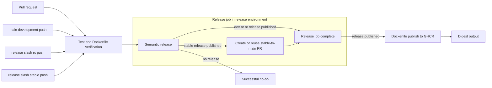

# Medrunner Service Delivery Workflows

## Status

This is the revised design proposal for a reusable GitHub Actions delivery platform for Medrunner API, MED bot, and MOD bot.

Implementation is deliberately limited to this repository.

The existing service worktrees contain user-owned, uncommitted workflow and Dockerfile changes and are out of scope.

## Goal

Provide the smallest reusable workflow surface that gives each service one ordered delivery pipeline.

The pipeline must run service tests, verify the Dockerfile build, calculate and publish a semantic GitHub release, back-propagate a stable release branch to development, and publish the Docker image to GHCR.

All image publication must use the caller's Dockerfile.

The platform must not publish an npm package, perform an AWS ECR push, generate an infrastructure deployment manifest, or use Python orchestration.

Release back-propagation is the one established C# and GitHub CLI composite action carried over from the Arkanis CI platform with only repository-local naming and path adjustments.

## Evidence and Constraints

`Medrunner-API` is a .NET 10 solution with a root Dockerfile and integration tests that require PostgreSQL 17.4.

`Medrunner-Patrol-Bot` and `mod-bot` are Node repositories with root Dockerfiles, `package-lock.json`, private `@medrunner-services/*` npm dependencies, and `build`, `lint`, `prettier`, and `test` scripts.

The existing pending service callers invoke an Aspire-hosted Python workflow on release-tag pushes.

That workflow hard-codes the three service identities and writes a deployment image-manifest artifact.

The replacement removes both concerns from the shared publisher.

An image-publish workflow triggered by a tag generated with `GITHUB_TOKEN` is not reliable because that event does not start another workflow run.

Release and publishing must therefore be dependent jobs in the same caller workflow.

## Release Channels

The platform uses the new, explicit promotion model for all three services.

Pull requests run verification only.

`main` is the development branch and creates `dev` prereleases, for example `v0.14.0-dev.1`.

`release/rc` creates `rc` prereleases, for example `v0.14.0-rc.1`.

`release/stable` creates stable releases, for example `v0.14.0`.

The channel is explicit at the caller boundary rather than inferred from a Docker tag.

Development publication produces immutable `vX.Y.Z-dev.N` and `X.Y.Z-dev.N` tags plus mutable `dev` and `dev-latest` aliases.

Release-candidate publication produces immutable `vX.Y.Z-rc.N` and `X.Y.Z-rc.N` tags plus mutable `rc` and `rc-latest` aliases.

Stable publication produces immutable `vX.Y.Z` and `X.Y.Z` tags plus mutable `stable` and `stable-latest` aliases.

Only stable publication produces the unqualified `latest` tag.

Every channel therefore has a channel-local moving alias, including `dev-latest`, `rc-latest`, and `stable-latest`.

Each caller declares the semantic-release branch policy as follows.

```js
branches: [
  { name: "release/stable", channel: "stable" },
  { name: "release/rc", channel: "rc", prerelease: "rc" },
  { name: "main", channel: "dev", prerelease: "dev" },
]
```

The configured prerelease identifiers are unique and exactly match the image channels.

## Architecture



The caller repository owns event triggers, branch policy configuration, image identity, and the choice of channel.

This CI repository owns the implementation of test, Docker verification, release, and Docker publication behavior.

The caller uses `needs` to make the order observable and pass semantic-release outputs directly into the publisher.

The semantic-release job performs stable back-propagation after the release was created and before it completes.

## Version Back-Propagation Boundary

Git tags are repository-wide refs, not branch-local objects that require copying.

Stable back-propagation merges the `release/stable` commit history into `main`, which makes the stable tagged commit reachable from `main` for `git describe` and equivalent version-discovery tools.

The imported C# action remains an unchanged PR transport and does not write a version file.

Before invoking that action, the release job checks whether the `release/stable` tip is already an ancestor of `main`.

It completes as a successful no-op when the tagged history is already reachable, avoiding an empty pull-request attempt.

No service version is hard-coded into source solely for release publication.

Publishers use semantic-release's immutable `new-version` and `new-tag` outputs, and build from the checked-out release tag.

## Reusable Workflow Contract

### `wf-test-dotnet.yml`

This workflow checks out the caller at full history only when required by the selected test behavior.

It installs the caller-selected .NET SDK, supports an explicit locked-restore mode, builds Release, and runs `dotnet test`.

Locked restore is disabled by default because the current API repository has no committed NuGet lock files.

Consumers enable it only after committing their lock files.

It exposes an optional typed PostgreSQL sidecar with a disabled default.

When enabled, the workflow uses an explicit image version, waits for health, and supplies host and port settings to the test process.

The API caller enables PostgreSQL 17.4.

The workflow does not expose a free-form shell hook for arbitrary service setup.

### `wf-test-node.yml`

This workflow checks out the caller, configures a selected Node version, authenticates only the selected npm scope, and runs `npm ci`.

It runs configured package scripts for build, lint, Prettier verification, and test in that order.

MED uses Node 24 and MOD uses Node 22 until their source Dockerfiles and runtime policy intentionally converge.

The private package token is `github.token` with `packages: read` and is never persisted in a repository file or artifact.

### `wf-verify-container.yml`

This workflow runs Docker Buildx against the caller-provided context and Dockerfile without pushing.

It is part of the Test stage because a release must not be created before its Dockerfile has built successfully.

For callers with private npm dependencies, it mounts `NODE_AUTH_TOKEN` as a BuildKit secret.

It never passes that credential as a Docker build argument.

### `wf-release-semantic.yml`

This workflow checks out the caller with complete Git history and runs semantic-release after all verification jobs succeed.

It uses a CI-owned base configuration containing only commit analysis, release-note generation, and GitHub release publication.

The base configuration intentionally excludes `@semantic-release/npm` and `@semantic-release/exec`.

The caller configuration extends that base and declares its approved branch policy.

The outputs are `release-published`, `new-version`, `new-tag`, and `new-channel`.

It accepts an `environment-name` input, defaulting to `release`, and applies it to the single release job.

The release job is serialized by repository and release environment.

For stable releases only, the job checks whether the release branch tip is already reachable from `main`, then invokes the established Arkanis C# composite action only when a `release/stable`-to-`main` pull request is needed.

It accepts explicit back-propagation inputs for source ref, default branch, labels, auto-merge policy, merge method, and approval behavior.

It receives an optional `PR_AUTOMATION_PAT` only when the caller enables approval because `GITHUB_TOKEN` cannot approve the pull request that it created.

Back-propagation is a step in the release job, not a separate workflow job, and does not run for `main` dev or `release/rc` candidate releases.

### `wf-publish-container.yml`

This workflow accepts a fully qualified image name, Docker context, Dockerfile path, semantic-release version, release tag, channel, and a stable-latest flag.

It checks out the immutable semantic-release tag with complete history before building, so Dockerfile version discovery uses the released source and can resolve `git describe` consistently.

It accepts an `environment-name` input, defaulting to `publish-ghcr`, and applies it to its publishing job.

It derives OCI labels and tags through `docker/metadata-action`, authenticates with `docker/login-action`, and pushes with `docker/build-push-action`.

It emits the registry digest and fully immutable `image@sha256:...` reference.

It does not know application names, deployment manifest keys, source repository names, or environments outside its explicit inputs.

## Security Model

The caller sets `permissions: {}` at workflow scope.

Test jobs receive `contents: read` and, when required, `packages: read`.

The release job receives `contents: write` for semantic-release and `pull-requests: write` because stable back-propagation is a conditional step in that same job.

The publisher receives `contents: read` and `packages: write`.

The back-propagation action uses those permissions only after a published stable release, but GitHub Actions declares the job permissions statically because it is one release job.

No job requests an OIDC token, attestation permission, AWS credential, personal access token, or inherited secret set.

Named secrets are passed only where a called workflow needs them.

The release and publish environments remain caller-controlled gates.

## Environments

Mutating reusable workflows accept an explicit `environment-name` input so callers can use organization-standard protection rules, secrets, and approvals without the workflow owning repository-specific policy.

The standard environment values are `release`, `publish-ghcr`, `publish-gh-npm`, and `publish-npm`.

`wf-release-semantic.yml` defaults to `release` and includes stable back-propagation in that same environment.

`wf-publish-container.yml` defaults to `publish-ghcr`.

The initial delivery does not implement npm publication because API, MED, and MOD only require Dockerfile-to-GHCR publication.

Future `wf-publish-gh-npm.yml` and `wf-publish-npm.yml` workflows must expose the same input and default respectively to `publish-gh-npm` and `publish-npm`.

They must accept `new-version` and `new-tag`, check out the immutable tag, and create package metadata from the release version only for the publishing workspace.

They must not require a source-hardcoded package version or commit a version mutation back to the service repository.

## Consumer Shape

Each service later replaces its separate build and tag-triggered publish workflows with one thin caller workflow.

The API caller uses the .NET workflow with PostgreSQL 17.4 and publishes `ghcr.io/medrunner-services/backend-api`.

The MED and MOD callers use the Node workflow with GitHub Packages authentication and publish `ghcr.io/medrunner-services/bot-med` and `ghcr.io/medrunner-services/bot-mod` respectively.

The caller invokes this platform through a released major reference such as `medrunner-services/ci/.github/workflows/wf-publish-container.yml@v1`.

It must not reference `main` in a production workflow.

## Files to Add

- `configs/semantic-release-service.cjs` defines the no-npm, no-exec semantic-release base configuration.
- `.github/workflows/wf-test-dotnet.yml` implements typed .NET test and optional PostgreSQL setup.
- `.github/workflows/wf-test-node.yml` implements authenticated Node verification.
- `.github/workflows/wf-verify-container.yml` builds the caller Dockerfile without publication.
- `.github/workflows/wf-release-semantic.yml` publishes semantic GitHub releases and exposes outputs.
- `.github/workflows/wf-publish-container.yml` publishes generic GHCR images from Dockerfiles.
- `.github/actions/release-backpropagation/action.yml` and `run-backpropagation.cs` carry the established back-propagation implementation.
- `docs/consumer-workflows.md` provides complete API, MED, and MOD caller templates, release-config snippets, and the common environment contract.
- `tests/workflow-contract/` provides local workflow callers and minimal fixtures for static and `act` smoke validation.

The existing root `release.config.cjs` remains the configuration for releasing this CI platform itself.

It is not used as the service-release base configuration because the platform's mutable major action-tag policy does not belong to application releases.

## Validation

Run `actionlint` in Docker against every workflow, fixture, and consumer template.

Run `act` in Docker against the Node, .NET, and Dockerfile verification fixtures.

Run the Dockerfile verification fixture both with and without the private-npm secret path selected.

Validate the semantic-release workflow contract statically and through an `act` dry-run fixture where GitHub release publication is disabled.

Validate the stable-only release-job back-propagation action interface with `actionlint` and an `act` fixture that reaches the stable caller path.

Validate the publishing fixtures use the semantic-release tag checkout and can resolve an exact `git describe` version from that checkout.

Do not execute the live GitHub CLI pull-request mutation during `act` validation.

Run `git diff --check`.

No live GitHub release, package publication, or registry push occurs during local validation.

GitHub must separately allow organization repositories to call reusable workflows from `medrunner-services/ci` before the consumer migrations can run.
