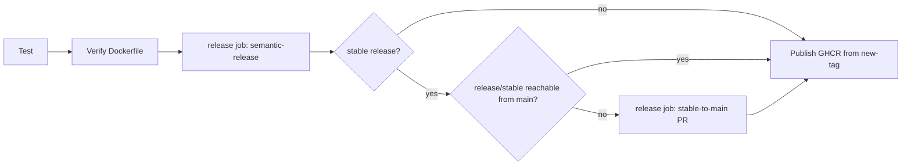

# Reusable workflow catalog

The platform publishes its reusable workflows at `medrunner-services/ci/.github/workflows/<name>@v1`.

The `v1` major tag is released by this repository's own `release.yml` workflow.

| Workflow | Purpose | Inputs | Secrets | Outputs | Job Permissions | Environment | Side Effects | Consumer Reference |
| --- | --- | --- | --- | --- | --- | --- | --- | --- |
| `wf-test-dotnet.yml` | Restore, build, and test a .NET target. | Runner selectors, `target`, SDK version, configuration, locked mode, and timeout. | None. | None. | `contents: read`. | None. | Runs caller tests only. | `medrunner-services/ci/.github/workflows/wf-test-dotnet.yml@v1` |
| `wf-test-node.yml` | Install, build, lint, format-check, and test a Node project. | Runner selectors, Node version, working directory, npm scope, private package flag, script flags, and timeout. | None. | None. | `contents: read`, `packages: read`. | None. | Reads private GitHub Packages only when requested. | `medrunner-services/ci/.github/workflows/wf-test-node.yml@v1` |
| `wf-verify-container.yml` | Build a Dockerfile without publishing it. | Runner selectors, context, Dockerfile, timeout, and optional publish-preflight metadata (`image`, `version`, `release-tag`, `channel`, and version build-arg name). | Optional `NODE_AUTH_TOKEN`. | None. | `contents: read`, `packages: read`. | None. | Builds through BuildKit with `push: false`; when all optional metadata is supplied, validates and injects the same release build argument as publication. | `medrunner-services/ci/.github/workflows/wf-verify-container.yml@v1` |
| `wf-release-semantic.yml` | Run caller-owned semantic-release rules and conditionally backpropagate stable history. | Runner selectors, `environment-name`, semantic-release version, optional extra plugin packages, and backpropagation options. | Optional `PR_AUTOMATION_PAT`. | `release-published`, `new-version`, `new-tag`, `new-channel`, `backprop-pr-url`, `backprop-pr-number`. | `contents: write`, `issues: write`, `pull-requests: write`. | `release` by default, override with `environment-name`. | Applies the caller semantic-release configuration, creates its Git tags and GitHub releases, and may create, approve, or auto-merge a stable-to-main PR. | `medrunner-services/ci/.github/workflows/wf-release-semantic.yml@v1` |
| `wf-publish-container.yml` | Check out a release tag and publish a Dockerfile-built image to GHCR. | Runner selectors, `environment-name`, image, context, Dockerfile, version, release tag, channel, and version build-arg name. | Optional `NODE_AUTH_TOKEN`. | `image-digest`, `image-reference`. | `contents: read`, `packages: write`. | `publish-ghcr` by default, override with `environment-name`. | Pushes immutable version tags and caller-selected channel aliases `<channel>` and `<channel>-latest`, plus `latest` for stable only. | `medrunner-services/ci/.github/workflows/wf-publish-container.yml@v1` |

## Delivery flow



The caller owns semantic-release rules.

The release job provides the protected execution environment, publishes the caller-defined release, and owns stable-history backpropagation.

The publish workflow receives `new-version`, `new-tag`, and `new-channel` directly from that job.

It checks out `new-tag`, so an image always derives from the immutable source selected by semantic-release.

## Standard protected environments

Use these organization-standard environment names when the relevant delivery capability exists in a service.

| Environment | Intended capability |
| --- | --- |
| `release` | Semantic versioning, Git tag creation, GitHub release creation, and release-history backpropagation. |
| `publish-ghcr` | Docker image publication to GitHub Container Registry. |
| `publish-gh-npm` | Private npm publication to GitHub Packages. |
| `publish-npm` | Public npm publication to npmjs.com. |

The bare Docker delivery path implements `release` and `publish-ghcr` now.

The npm environment names are reserved for future npm publisher workflows where a service actually publishes a package.

## Version provenance

Semantic-release Git tags are the version authority.

No workflow requires a source-hardcoded version string.

Dockerfiles may consume the generated `VERSION` build argument to stamp build metadata from the release tag.

For example, the API Dockerfile can use:

```dockerfile
ARG VERSION
RUN dotnet publish "MedrunnerApi.csproj" -c Release -p:Version="$VERSION" -o /app/publish
```

`VERSION` is generated by the publisher after it validates the semantic-release output.

## Local verification boundary

The local fixture suite validates workflow syntax, test behavior, and public and private Dockerfile builds.

It does not execute semantic release, protected environment gates, GitHub release or pull-request writes, auto-merge, or external package publication.

The reproducible commands are maintained in the [README validation section](../README.md#local-validation).
